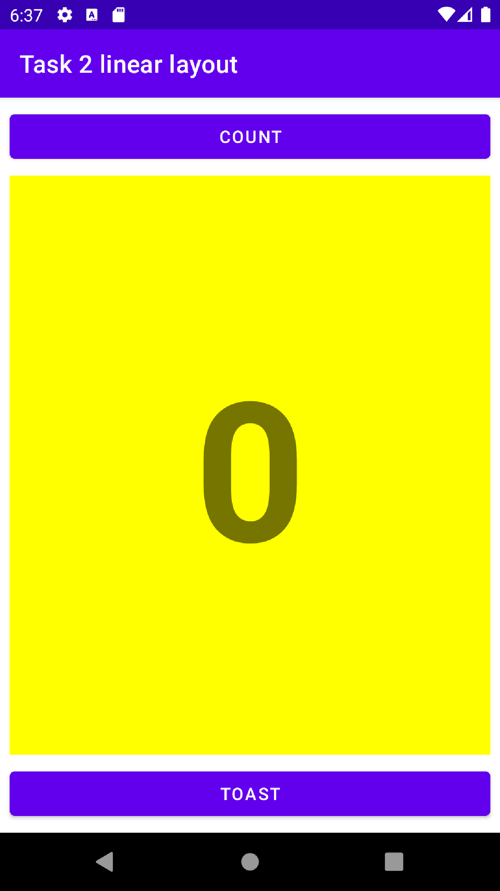

# Task 2 Change Layout into Linear Layout.

- Changed Constraint layout to Linear Layout.
- set layout orientation into vertical.
- Changed element attributes for linear layout.
- Adding weight and Gravity of text View Element.

## Linear Layout Vertical Layout
