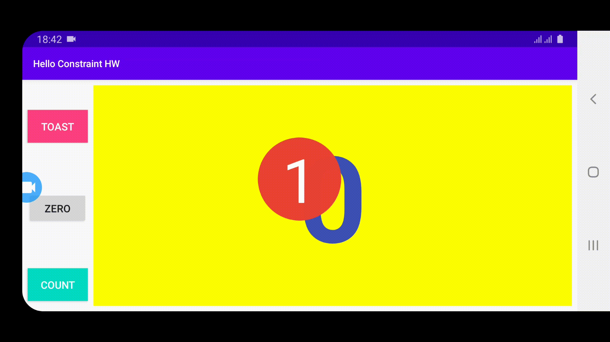
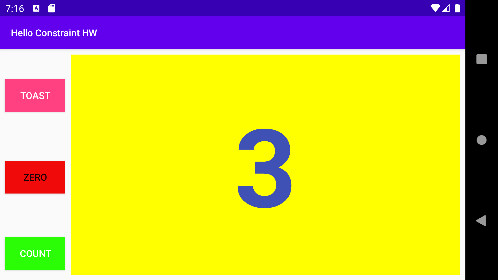
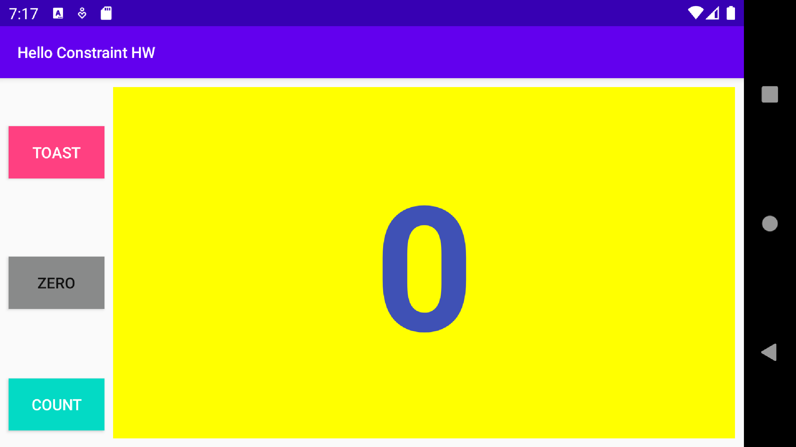
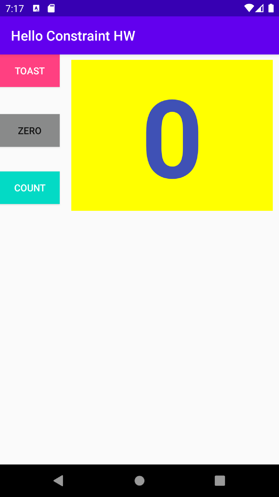

# Layout Editor Home Work
- Aligned two button in the left side of text view.
- Added new button zero in the middle of those two buttons.
- Adding other two layout for activity(land) and for activity tablet.
- Adding Zero button helps to make reverse into zero.
- The click handler for the count button changes its own background color.
- Button zero button change its background color to set the value into zero.
## Layout editor in GIF

## Horizontal count

## Horizontal back to zero

## Vertical layout

## Tablet layout
