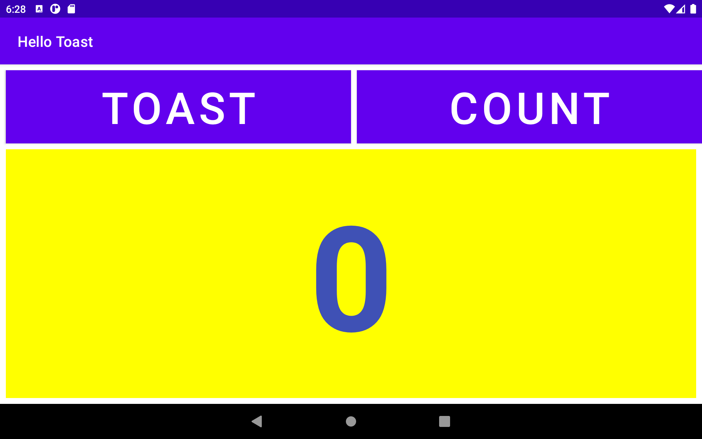
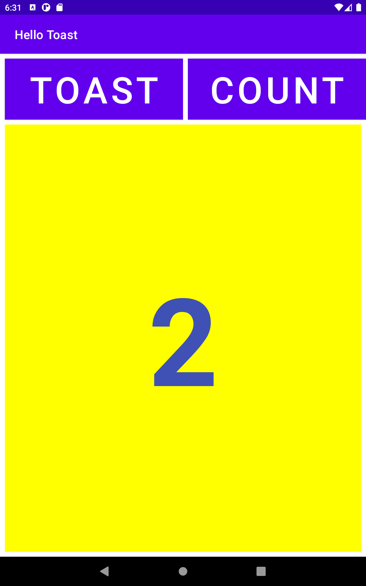

# The Layout Editor Lab1
- In This lab exercise there was three layout shown below.
- First activity layout shows the vertical orientation.
- Second land (Auto-Rotation) Activity shows the horizontal orientation.
- Third Activity represent the tablet mode Layout.
- All of three have their own unique layout constraint which is fit into all types of screen in mobile devices.

## Vertical Layout Orientation

## Horizontal land Orientation

## Tablet Layout
### Tablet Horizontal

### Tablet Vertical
